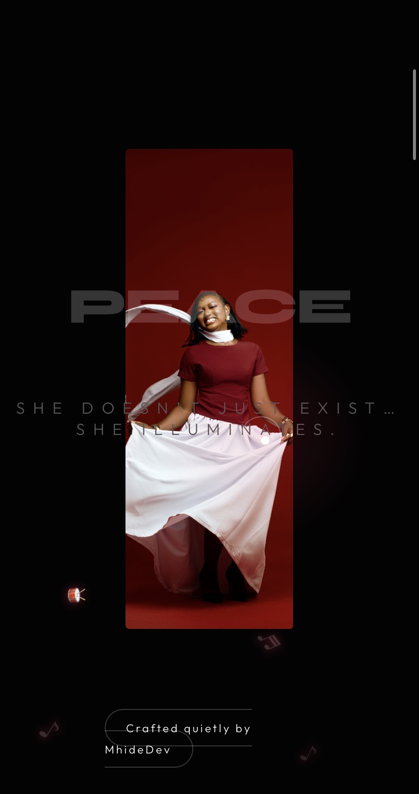

# Peace-Birthday-Website
A cinematic, animated, and sweet birthday website for Peace, crafted by Mhide.
# 🎉 Peace Birthday Website

A cinematic, animated, and heartfelt birthday website for **Peace**, crafted by **Mhide**.  
This project is built with **HTML, CSS, JavaScript**, and **GSAP** for premium scroll-triggered animations.

---

## 🖤 Features

- Fullscreen, one-word cinematic panels
- Smooth scroll animations using **GSAP** and **ScrollTrigger**
- High-end cursor effect with trailing ring
- Image gallery with cinematic overlays
- Responsive design for all devices
- Subtle background noise & soft shadows
- Elegant typography using **Syne** and **Outfit** fonts
- Magnetic link button for footer branding

---

## 🎨 Color Palette

- Background: #030303 (dark, cinematic)
- Accent: #ffffff (clean and elegant)
- Secondary: #555 (soft text)
- Optional highlights: blush pink, lavender, gold accents

---

## 🛠️ Tech Stack

- **HTML5**  
- **CSS3**  
- **JavaScript**  
- **GSAP 3** (for animations)  
- **ScrollTrigger** (scroll-based animation triggers)  

---

